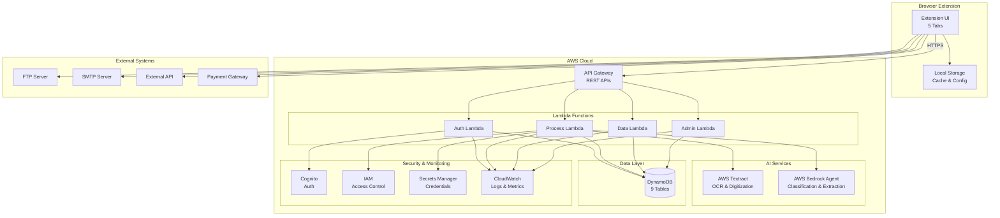
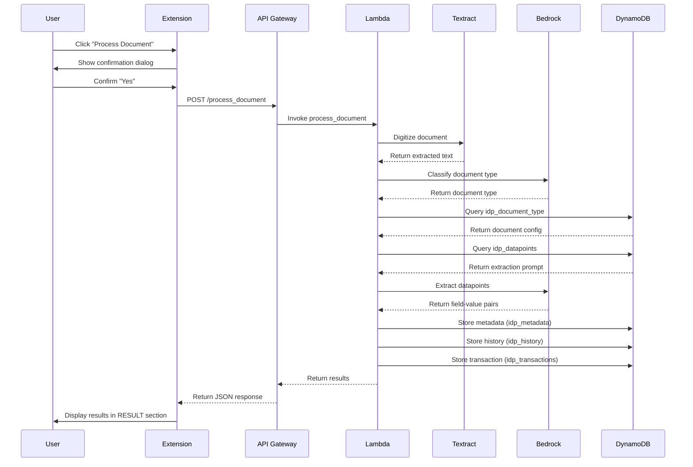
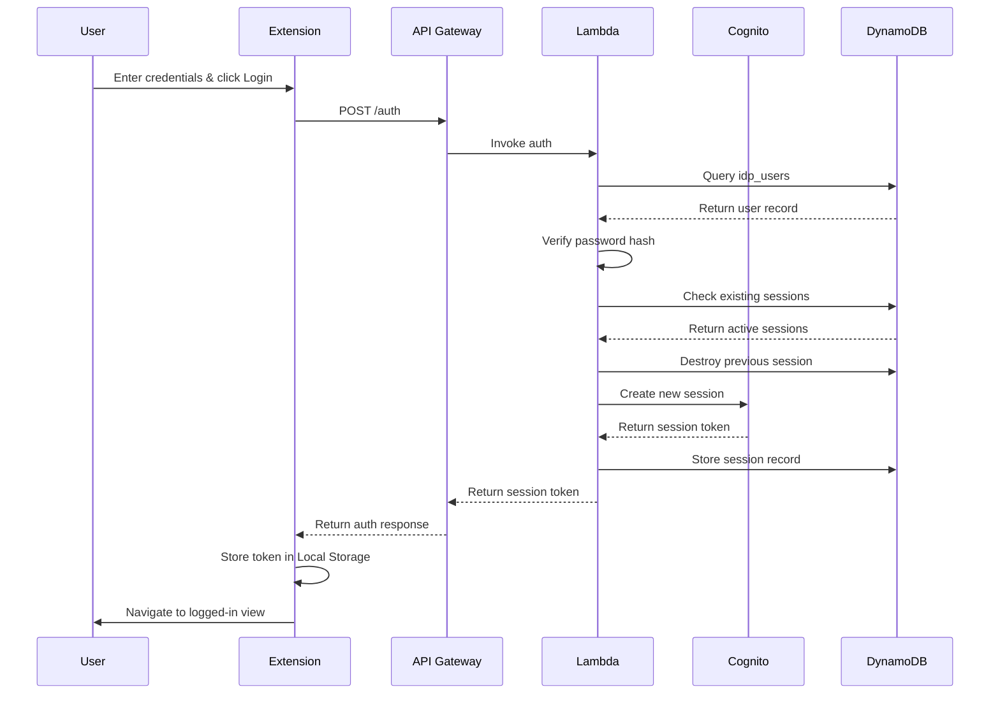
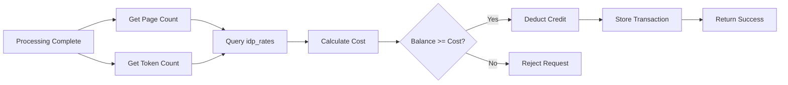
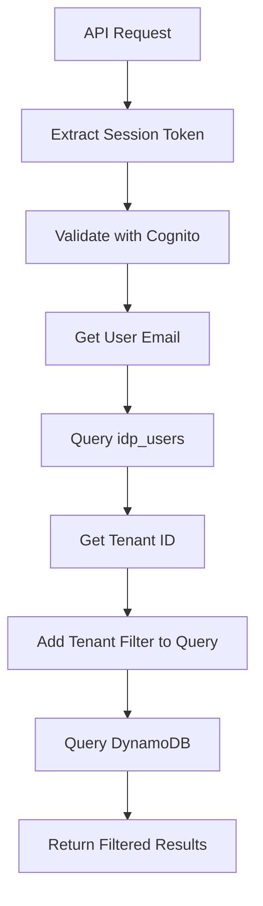

# Design Document: AI Document Processing Browser Extension

## Overview

The AI Document Processing browser extension is a Chrome/Edge-compatible application that enables users to extract structured data from unstructured documents directly in their browser. The system uses a serverless architecture combining a lightweight browser extension frontend with AWS backend services (API Gateway, Lambda, Textract, Bedrock, DynamoDB) to provide template-free document intelligence at the point of discovery.

The architecture follows a clear separation between presentation (browser extension), business logic (Lambda functions), and data storage (DynamoDB), with AI services (Textract, Bedrock) handling document digitization and extraction. The system supports multi-tenant operation with role-based access control, credit-based billing, and comprehensive audit logging.

## Architecture

### High-Level Architecture



### Document Processing Flow



### Authentication Flow



## Components and Interfaces

### Browser Extension Components

#### 1. Dashboard Tab Component

**Responsibilities:**
- Display document processing interface
- Show extraction results in editable table
- Display metadata and history
- Provide action buttons for export/integration

**Key Functions:**
- `processDocument()`: Send document to API Gateway
- `displayResults(data)`: Render extraction results in RESULT table
- `displayMetadata(metadata)`: Render metadata in METADATA section
- `loadHistory()`: Fetch and display processing history
- `editResultField(fieldName, newValue)`: Handle inline editing of results

**State Management:**
- Current document processing status
- Extraction results (field-value pairs)
- Metadata (Processing ID, tokens, KPIs)
- History records (latest 20)
- Selected prompt/document type

**API Interactions:**
- POST `/process_document` - Send document for processing
- GET `/history` - Fetch processing history

#### 2. Prompts/Datapoints Tab Component

**Responsibilities:**
- Display and manage extraction prompts
- Cache prompts in Local Storage
- Allow CRUD operations on prompts

**Key Functions:**
- `loadPrompts()`: Fetch prompts from API or cache
- `addPrompt(promptData)`: Create new prompt
- `editPrompt(promptId, promptData)`: Update existing prompt
- `deletePrompt(promptId)`: Remove prompt
- `resetPrompts()`: Reload from API and refresh cache
- `exportPromptsToCSV()`: Generate CSV export

**State Management:**
- List of prompts (cached)
- Edit mode state
- Form validation state

**API Interactions:**
- GET `/datapoints` - Fetch all prompts
- POST `/reset_prompts` - Reload prompts from server

**Local Storage Schema:**
```javascript
{
  "prompts": [
    {
      "prompt_id": "uuid",
      "prompt_name": "string",
      "description": "string",
      "prompt": "string",
      "created_by": "string",
      "created_date": "timestamp",
      "modified_by": "string",
      "modified_date": "timestamp"
    }
  ],
  "last_sync": "timestamp"
}
```

#### 3. Settings Tab Component

**Responsibilities:**
- Manage FTP, Email, and API configurations
- Store settings in Local Storage with encryption
- Test connections to external systems

**Key Functions:**
- `loadSettings()`: Retrieve settings from Local Storage
- `saveSettings(settings)`: Store settings with encryption
- `testFTPConnection()`: Validate FTP configuration
- `testEmailConnection()`: Validate email configuration (API or SMTP)
- `testAPIConnection()`: Validate external API configuration
- `encryptPassword(password)`: Encrypt sensitive credentials
- `decryptPassword(encryptedPassword)`: Decrypt credentials for use

**State Management:**
- FTP configuration
- Email configuration (mode, server, credentials)
- API configuration
- Test connection status

**Local Storage Schema:**
```javascript
{
  "ftp": {
    "host": "string",
    "port": "number",
    "username": "string",
    "password": "encrypted_string",
    "remote_directory": "string"
  },
  "email": {
    "mode": "default|smtp",
    "to": "string",
    "cc": "string",
    "subject": "string",
    "smtp_server": "string",
    "smtp_port": "number",
    "smtp_username": "string",
    "smtp_password": "encrypted_string",
    "email_from": "string",
    "attachment_formats": ["csv", "xlsx", "json"]
  },
  "api": {
    "method": "GET|POST",
    "endpoint": "string",
    "headers": "object",
    "body": "string"
  }
}
```

**API Interactions:**
- POST `/send_email` - Test default email server
- POST `/ftp` - Test FTP connection

**External Libraries:**
- smtp.js - Client-side SMTP email sending

#### 4. Profile Tab Component

**Responsibilities:**
- Handle user authentication
- Display user profile and statistics
- Manage profile updates and password changes
- Show transaction history
- Handle top-up payments

**Key Functions:**
- `login(email, password, rememberMe)`: Authenticate user
- `logout()`: Destroy session
- `loadProfile()`: Fetch user data and statistics
- `updateProfile(firstName, lastName)`: Update user information
- `changePassword(currentPassword, newPassword, confirmPassword)`: Update password
- `loadTransactions(page)`: Fetch transaction history with pagination
- `topUp(amount, remark)`: Initiate payment and credit top-up
- `forgetPassword(email)`: Request password reset
- `signUp(userData)`: Register new user

**State Management:**
- Authentication status
- Session token
- User profile data
- Documents processed count
- Available balance
- Transaction history
- Form validation state

**API Interactions:**
- POST `/auth` - User login
- POST `/forget_password` - Request password reset
- POST `/reset_password` - Submit new password
- POST `/sign_up` - Register new user
- GET `/total_document_processed` - Get processing count
- GET `/available_balance` - Get current balance
- POST `/profile_change` - Update profile
- POST `/password_change` - Change password
- GET `/mytransactions` - Fetch transaction history
- POST `/top_up` - Process credit top-up

**Local Storage Schema:**
```javascript
{
  "session": {
    "token": "string",
    "user_email": "string",
    "user_name": "string",
    "role": "string",
    "tenant": "string",
    "remember_me": "boolean",
    "expires_at": "timestamp"
  }
}
```

#### 5. Admin Tab Component

**Responsibilities:**
- Add credits to user accounts (System User only)
- Validate System User role

**Key Functions:**
- `addCredit(email, amount)`: Add credit to specified user
- `validateSystemUserRole()`: Check if current user has admin privileges

**State Management:**
- Form input state
- Operation status

**API Interactions:**
- POST `/add_credit` - Add credit to user account

#### 6. Action Buttons Component

**Responsibilities:**
- Export data in multiple formats
- Integrate with external systems
- Handle file generation and transmission

**Key Functions:**
- `copyToClipboard(data)`: Copy RESULT data to clipboard
- `exportToCSV(data)`: Generate and download CSV file
- `exportToXLSX(data)`: Generate and download XLSX file
- `exportToJSON(data)`: Generate and download JSON file
- `exportToFTP(data)`: Upload data to configured FTP server
- `submitToAPI(data)`: Send data to configured external API
- `sendEmail(data)`: Send data via email with attachments

**External Libraries:**
- PapaParse or similar - CSV generation
- SheetJS (xlsx) - XLSX generation
- smtp.js - SMTP email sending

**State Management:**
- Export operation status
- Progress indicators

### Backend Lambda Functions

#### 1. Auth Lambda

**Responsibilities:**
- User authentication
- Session management
- Password reset and recovery
- User registration

**Functions:**
- `handle_auth(event)`: Validate credentials and create session
- `handle_forget_password(event)`: Send password reset email
- `handle_reset_password(event)`: Update user password
- `handle_sign_up(event)`: Create new user account
- `validate_credentials(email, password_hash)`: Check user credentials
- `create_session(user_id)`: Generate session token via Cognito
- `destroy_previous_sessions(user_id)`: Invalidate old sessions
- `hash_password(password)`: Generate secure password hash
- `send_reset_email(email, reset_token)`: Send password reset link

**DynamoDB Tables:**
- idp_users (read/write)
- idp_roles (read)

**AWS Services:**
- Cognito - Session token generation
- SES - Email sending for password reset

**Error Handling:**
- Invalid credentials → 401 Unauthorized
- User not found → 404 Not Found
- Session creation failure → 500 Internal Server Error
- Email sending failure → Log warning, return success (async)

#### 2. Process Document Lambda

**Responsibilities:**
- Orchestrate document processing pipeline
- Coordinate Textract and Bedrock services
- Store processing results and metadata
- Manage credit deduction

**Functions:**
- `handle_process_document(event)`: Main processing orchestrator
- `digitize_document(document_data)`: Call Textract for OCR
- `classify_document(text_content)`: Use Bedrock to identify document type
- `get_document_type_config(document_type, tenant)`: Query document type table
- `get_extraction_prompt(document_type, tenant)`: Query datapoints table
- `extract_datapoints(text_content, prompt)`: Use Bedrock for extraction
- `calculate_credit_cost(pages, tokens)`: Determine processing cost
- `deduct_credit(user_id, cost)`: Update user balance
- `store_metadata(processing_data)`: Save to idp_metadata
- `store_history(processing_data)`: Save to idp_history
- `store_transaction(transaction_data)`: Save to idp_transactions
- `generate_processing_id()`: Create UUID for processing operation

**DynamoDB Tables:**
- idp_document_type (read)
- idp_datapoints (read)
- idp_metadata (write)
- idp_history (write)
- idp_transactions (read/write)
- idp_rates (read)
- idp_users (read)

**AWS Services:**
- Textract - Document digitization
- Bedrock - AI classification and extraction
- CloudWatch - Logging and metrics

**Processing Pipeline:**
1. Validate user session and credit balance
2. Generate Processing ID (UUID)
3. Send document to Textract for digitization
4. Extract text and page count from Textract response
5. Send text to Bedrock for document type classification
6. Query idp_document_type for document configuration
7. Query idp_datapoints for extraction prompt
8. Send text and prompt to Bedrock for datapoint extraction
9. Parse Bedrock response into field-value pairs
10. Calculate credit cost based on pages and tokens
11. Deduct credit from user balance
12. Store metadata in idp_metadata
13. Store history record in idp_history
14. Store transaction in idp_transactions
15. Return results to client

**Error Handling:**
- Insufficient credit → 402 Payment Required
- Textract failure → Retry once, then 500 Internal Server Error
- Bedrock failure → Retry once, then 500 Internal Server Error
- Document type not found → Use default extraction prompt
- DynamoDB write failure → Rollback transaction, 500 Internal Server Error

#### 3. Data Lambda

**Responsibilities:**
- Fetch user data and statistics
- Manage prompts and datapoints
- Retrieve processing history
- Handle profile updates

**Functions:**
- `handle_datapoints(event)`: Fetch all prompts for tenant
- `handle_reset_prompts(event)`: Reload prompts from master data
- `handle_history(event)`: Fetch processing history with pagination
- `handle_mytransactions(event)`: Fetch transaction history with pagination
- `handle_total_document_processed(event)`: Count user's processed documents
- `handle_available_balance(event)`: Calculate current credit balance
- `handle_profile_change(event)`: Update user profile information
- `handle_password_change(event)`: Update user password
- `filter_by_tenant(data, tenant)`: Apply tenant isolation

**DynamoDB Tables:**
- idp_datapoints (read)
- idp_history (read)
- idp_transactions (read)
- idp_users (read/write)

**Error Handling:**
- Invalid pagination parameters → 400 Bad Request
- User not found → 404 Not Found
- Unauthorized access → 403 Forbidden

#### 4. Admin Lambda

**Responsibilities:**
- Administrative credit management
- System user operations

**Functions:**
- `handle_add_credit(event)`: Add credit to user account
- `validate_system_user(user_id)`: Verify System User role
- `create_admin_transaction(user_id, amount, admin_id)`: Record credit addition

**DynamoDB Tables:**
- idp_users (read)
- idp_roles (read)
- idp_transactions (write)

**Error Handling:**
- Non-System User access → 403 Forbidden
- Target user not found → 404 Not Found
- Invalid credit amount → 400 Bad Request

#### 5. Integration Lambda

**Responsibilities:**
- Handle FTP uploads
- Send emails via default server
- Test external connections

**Functions:**
- `handle_ftp(event)`: Upload file to FTP server
- `handle_send_email(event)`: Send email with attachments
- `test_ftp_connection(config)`: Validate FTP configuration
- `get_ftp_credentials()`: Retrieve credentials from Secrets Manager

**AWS Services:**
- Secrets Manager - FTP/SMTP credentials
- SES - Email sending

**Error Handling:**
- FTP connection failure → 503 Service Unavailable
- Email sending failure → 500 Internal Server Error
- Invalid configuration → 400 Bad Request

### API Gateway Configuration

**Base URL:** `https://api.{domain}/v1`

**Endpoints:**

| Endpoint | Method | Lambda | Auth Required | Description |
|----------|--------|--------|---------------|-------------|
| /auth | POST | Auth Lambda | No | User login |
| /forget_password | POST | Auth Lambda | No | Request password reset |
| /reset_password | POST | Auth Lambda | No | Submit new password |
| /sign_up | POST | Auth Lambda | No | Register new user |
| /process_document | POST | Process Lambda | Yes | Process document |
| /datapoints | GET | Data Lambda | Yes | Fetch prompts |
| /reset_prompts | POST | Data Lambda | Yes | Reload prompts |
| /history | GET | Data Lambda | Yes | Fetch processing history |
| /mytransactions | GET | Data Lambda | Yes | Fetch transactions |
| /total_document_processed | GET | Data Lambda | Yes | Get document count |
| /available_balance | GET | Data Lambda | Yes | Get credit balance |
| /profile_change | POST | Data Lambda | Yes | Update profile |
| /password_change | POST | Data Lambda | Yes | Change password |
| /top_up | POST | Data Lambda | Yes | Process credit top-up |
| /add_credit | POST | Admin Lambda | Yes (System User) | Add credit to user |
| /ftp | POST | Integration Lambda | Yes | Upload to FTP |
| /send_email | POST | Integration Lambda | Yes | Send email |

**Request/Response Format:**

All requests and responses use JSON format.

**Authentication:**
- Authenticated endpoints require `Authorization: Bearer {token}` header
- Token validated via Cognito
- Invalid/expired tokens return 401 Unauthorized

**Rate Limiting:**
- 100 requests per minute per user
- 1000 requests per minute per tenant

**CORS Configuration:**
- Allow origins: Chrome extension ID, Edge extension ID
- Allow methods: GET, POST, OPTIONS
- Allow headers: Content-Type, Authorization

## Data Models

### DynamoDB Tables

#### 1. idp_users

**Purpose:** Store user account information

**Schema:**
```python
{
  "email": "string",  # Partition Key
  "password_hash": "string",
  "first_name": "string",
  "last_name": "string",
  "contact_number": "string",
  "tenant": "string",  # GSI Partition Key
  "role": "string",  # Values: "User", "System User"
  "created_date": "timestamp",
  "modified_date": "timestamp",
  "is_active": "boolean"
}
```

**Indexes:**
- Primary Key: email
- GSI: tenant-email-index (tenant, email)

**Access Patterns:**
- Get user by email
- List users by tenant

#### 2. idp_roles

**Purpose:** Define role permissions

**Schema:**
```python
{
  "role_id": "string",  # Partition Key
  "role_name": "string",
  "permissions": "list",  # List of permission strings
  "created_date": "timestamp"
}
```

**Indexes:**
- Primary Key: role_id

**Access Patterns:**
- Get role by ID
- List all roles

#### 3. idp_transactions

**Purpose:** Track credit usage and top-ups

**Schema:**
```python
{
  "transaction_id": "string",  # Partition Key (UUID)
  "user_email": "string",  # GSI Partition Key
  "tenant": "string",
  "processing_id": "string",  # Optional, for processing transactions
  "action": "string",  # Values: "Utilized", "Top-up", "Admin Credit"
  "amount": "number",  # Positive for top-up, negative for usage
  "pages": "number",  # Optional, for processing transactions
  "timestamp": "timestamp",  # GSI Sort Key
  "remark": "string"  # Optional
}
```

**Indexes:**
- Primary Key: transaction_id
- GSI: user_email-timestamp-index (user_email, timestamp)

**Access Patterns:**
- Get transaction by ID
- List transactions by user (sorted by timestamp)
- Calculate balance by summing amounts for user

#### 4. idp_history

**Purpose:** Store processing history for quick retrieval

**Schema:**
```python
{
  "processing_id": "string",  # Partition Key (UUID)
  "user_email": "string",  # GSI Partition Key
  "tenant": "string",
  "document_name": "string",
  "document_type": "string",
  "pages": "number",
  "extracted_values": "map",  # Field-value pairs
  "timestamp": "timestamp",  # GSI Sort Key
  "file_type": "string",
  "file_size": "number"
}
```

**Indexes:**
- Primary Key: processing_id
- GSI: user_email-timestamp-index (user_email, timestamp)

**Access Patterns:**
- Get history by processing ID
- List history by user (sorted by timestamp, paginated)

#### 5. idp_metadata

**Purpose:** Store detailed processing metadata and KPIs

**Schema:**
```python
{
  "processing_id": "string",  # Partition Key (UUID)
  "user_email": "string",
  "tenant": "string",
  "document_name": "string",
  "prompt_name": "string",
  "pages": "number",
  "creation_date": "timestamp",
  "file_type": "string",
  "file_size": "number",
  "input_tokens": "number",
  "output_tokens": "number",
  "textract_duration_ms": "number",
  "bedrock_classification_duration_ms": "number",
  "bedrock_extraction_duration_ms": "number",
  "total_duration_ms": "number",
  "textract_confidence": "number",
  "bedrock_model_id": "string",
  "credit_cost": "number"
}
```

**Indexes:**
- Primary Key: processing_id

**Access Patterns:**
- Get metadata by processing ID

#### 6. idp_datapoints

**Purpose:** Store extraction prompts and datapoint definitions

**Schema:**
```python
{
  "prompt_id": "string",  # Partition Key (UUID)
  "tenant": "string",  # GSI Partition Key
  "prompt_name": "string",
  "description": "string",
  "prompt": "string",  # The actual prompt text for Bedrock
  "datapoints": "list",  # List of field names to extract
  "created_by": "string",
  "created_date": "timestamp",
  "modified_by": "string",
  "modified_date": "timestamp"
}
```

**Indexes:**
- Primary Key: prompt_id
- GSI: tenant-prompt_name-index (tenant, prompt_name)

**Access Patterns:**
- Get prompt by ID
- List prompts by tenant
- Get prompt by name and tenant

#### 7. idp_document_type

**Purpose:** Define document type classifications

**Schema:**
```python
{
  "document_type_id": "string",  # Partition Key
  "tenant": "string",  # GSI Partition Key
  "document_type_name": "string",
  "classification_keywords": "list",  # Keywords for classification
  "default_prompt_id": "string",  # Reference to idp_datapoints
  "created_date": "timestamp"
}
```

**Indexes:**
- Primary Key: document_type_id
- GSI: tenant-document_type_name-index (tenant, document_type_name)

**Access Patterns:**
- Get document type by ID
- List document types by tenant
- Get document type by name and tenant

#### 8. idp_rates

**Purpose:** Define pricing for document processing

**Schema:**
```python
{
  "rate_id": "string",  # Partition Key
  "tenant": "string",
  "rate_type": "string",  # Values: "per_page", "per_token", "base"
  "amount": "number",
  "effective_date": "timestamp",
  "expiry_date": "timestamp"
}
```

**Indexes:**
- Primary Key: rate_id

**Access Patterns:**
- Get current rates by tenant

#### 9. idp_settings

**Purpose:** Store system-wide configuration

**Schema:**
```python
{
  "setting_key": "string",  # Partition Key
  "tenant": "string",
  "setting_value": "string",
  "modified_date": "timestamp"
}
```

**Indexes:**
- Primary Key: setting_key

**Access Patterns:**
- Get setting by key

### Data Flow Diagrams

#### Credit Calculation Flow



#### Multi-Tenant Data Isolation



## Correctness Properties

*A property is a characteristic or behavior that should hold true across all valid executions of a system—essentially, a formal statement about what the system should do. Properties serve as the bridge between human-readable specifications and machine-verifiable correctness guarantees.*


### Property Reflection

After analyzing all acceptance criteria, I've identified several areas where properties can be consolidated:

**Consolidation Opportunities:**
1. **Data Storage Properties (1.8-1.11, 12.2-12.5)**: Multiple properties test that data is stored in correct tables. These can be combined into a single comprehensive property about data persistence.
2. **Export Format Properties (3.2-3.4)**: CSV, XLSX, and JSON export can be tested with a single round-trip property.
3. **Session Management (6.3-6.6)**: Session creation, storage, and validation can be combined into a comprehensive session lifecycle property.
4. **Tenant Isolation (23.2-23.7)**: All tenant filtering properties can be combined into a single comprehensive tenant isolation property.
5. **Alert Display (3.8-3.9, 14.1-14.3)**: All alert/feedback properties can be combined into a single property about user feedback.
6. **CRUD Operations (4.3-4.10)**: Prompt CRUD operations can be tested with a single property about Local_Storage consistency.

**Properties to Keep Separate:**
- Document processing pipeline (unique workflow)
- Credit calculation and deduction (financial accuracy critical)
- Password hashing and encryption (security critical)
- Role-based access control (authorization critical)
- API routing (infrastructure critical)

### Core Correctness Properties

#### Property 1: Document Processing Pipeline Completeness
*For any* valid document submitted for processing, the system should complete all pipeline stages (digitization, classification, extraction) and store results in all three tables (idp_metadata, idp_history, idp_transactions) with a unique Processing_ID.

**Validates: Requirements 1.1, 1.2, 1.3, 1.4, 1.5, 1.6, 1.7, 1.8, 1.9, 1.10, 1.11**

#### Property 2: UUID Uniqueness
*For any* set of processing operations, all generated Processing_IDs should be valid UUIDs and unique across all operations.

**Validates: Requirements 1.7**

#### Property 3: Export Format Round-Trip
*For any* extracted result data, exporting to CSV/XLSX/JSON and then parsing the exported file should produce data equivalent to the original extraction results.

**Validates: Requirements 3.2, 3.3, 3.4**

#### Property 4: Local Storage Consistency
*For any* sequence of CRUD operations on prompts (create, read, update, delete), the Local_Storage state should accurately reflect the final state after all operations complete.

**Validates: Requirements 4.2, 4.6, 4.7, 4.9, 4.10**

#### Property 5: Settings Persistence Round-Trip
*For any* valid settings configuration (FTP, Email, API), saving to Local_Storage and then loading should produce settings equivalent to the original configuration, with encrypted fields properly decrypted.

**Validates: Requirements 5.1, 5.3, 5.11**

#### Property 6: Single Active Session Per User
*For any* user, when a new session is created, all previous sessions for that user should be destroyed, ensuring exactly one active session exists.

**Validates: Requirements 6.4, 6.5**

#### Property 7: Session Token Validity
*For any* authenticated request, the session token should be validated by Cognito, and invalid or expired tokens should result in 401 Unauthorized responses.

**Validates: Requirements 6.3, 6.6, 10.7, 13.3**

#### Property 8: Password Hash Irreversibility
*For any* user password, the stored value in idp_users table should be a hash, and it should be computationally infeasible to derive the original password from the hash.

**Validates: Requirements 13.1**

#### Property 9: Credential Encryption
*For any* sensitive credential stored in Local_Storage (FTP password, SMTP password), the stored value should be encrypted, and decryption should produce the original credential.

**Validates: Requirements 5.3, 13.2**

#### Property 10: Role-Based Access Control
*For any* user attempting to access the Admin tab or call the add_credit API, access should be granted if and only if the user has System_User role.

**Validates: Requirements 9.1, 9.2, 9.5, 13.6, 13.7**

#### Property 11: Credit Balance Calculation
*For any* user, the available balance should equal the sum of all transaction amounts in idp_transactions table for that user, where top-ups are positive and processing costs are negative.

**Validates: Requirements 22.2, 22.4, 22.5, 22.6**

#### Property 12: Insufficient Balance Rejection
*For any* document processing request where the user's available balance is less than the calculated cost, the system should reject the request with an insufficient balance error before processing begins.

**Validates: Requirements 22.3**

#### Property 13: Credit Cost Calculation
*For any* document processing operation, the credit cost should be calculated based on the idp_rates table using the document's page count and token count, and the calculation should be deterministic and consistent.

**Validates: Requirements 22.1**

#### Property 14: Tenant Data Isolation
*For any* user query (prompts, document types, transaction history, processing history), the returned results should contain only data where the tenant field matches the user's tenant, ensuring complete data isolation between tenants.

**Validates: Requirements 23.2, 23.3, 23.4, 23.5, 23.6, 23.7**

#### Property 15: Tenant Assignment
*For any* newly created user, the user record should have a tenant assigned, and the tenant should be a valid, non-empty value.

**Validates: Requirements 23.1**

#### Property 16: API Request Routing
*For any* valid API request to API_Gateway, the request should be routed to the corresponding Lambda function, and the Lambda should return a response through API_Gateway to the client.

**Validates: Requirements 10.1, 10.2, 10.3, 10.4**

#### Property 17: Error Logging Completeness
*For any* Lambda function execution that encounters an error, the system should log the error message, stack trace, and context to CloudWatch before returning an error response.

**Validates: Requirements 10.5, 14.4, 21.2**

#### Property 18: Success Metrics Logging
*For any* Lambda function execution that completes successfully, the system should log execution start, completion, and duration metrics to CloudWatch.

**Validates: Requirements 14.5, 21.1, 21.3**

#### Property 19: User Feedback Consistency
*For any* operation (API call, export, integration), the Extension should display exactly one alert message (error, warning, or success) corresponding to the operation outcome.

**Validates: Requirements 3.8, 3.9, 14.1, 14.2, 14.3, 14.8**

#### Property 20: Asynchronous UI Responsiveness
*For any* long-running operation (document processing, API calls), the Extension should display a loading indicator during execution and hide it upon completion, without blocking user interaction with other UI elements.

**Validates: Requirements 15.2, 15.3**

#### Property 21: Cache Consistency
*For any* data cached in Local_Storage (prompts, settings), the cached data should match the server data until explicitly invalidated, and cache hits should avoid redundant API calls.

**Validates: Requirements 4.1, 4.2, 15.7**

#### Property 22: Email Attachment Format Compliance
*For any* email sent with attachments, the attached files should be in the formats selected in the attachment format checkboxes (CSV, XLSX, JSON), and each format should contain the complete extracted data.

**Validates: Requirements 18.3, 18.4, 18.5, 18.6, 18.7**

#### Property 23: FTP Upload Path Correctness
*For any* FTP upload operation, if a Remote Directory is specified in configuration, the file should be uploaded to that directory; otherwise, it should be uploaded to the FTP server's default directory.

**Validates: Requirements 19.3, 19.4**

#### Property 24: Transaction History Completeness
*For any* user, the transaction history should include all processing operations (with negative amounts), all top-ups (with positive amounts), and all administrative credits (with positive amounts and admin metadata).

**Validates: Requirements 22.4, 22.5, 22.8**

#### Property 25: Document Type Classification Consistency
*For any* document processed multiple times with the same content, the Bedrock_Agent should classify it as the same document type consistently.

**Validates: Requirements 11.3, 11.4**

#### Property 26: Datapoint Extraction Completeness
*For any* document processed with a specific prompt, the extracted results should include all datapoints defined in that prompt, with each datapoint having either an extracted value or a null/empty indicator.

**Validates: Requirements 11.6, 11.7**

#### Property 27: Metadata Capture Completeness
*For any* processing operation, the idp_metadata table should contain all required fields: Processing_ID, Document Name, Prompt Name, Pages, Creation Date, File Type, File Size, Input Tokens, Output Tokens, and LLM KPIs.

**Validates: Requirements 1.8**

#### Property 28: Browser API Usage Correctness
*For any* browser-specific operation (Local_Storage access, file downloads, clipboard access), the Extension should use the appropriate Chrome/Edge browser API and handle API errors gracefully.

**Validates: Requirements 17.3, 17.4, 17.5, 17.6**

#### Property 29: Password Validation Consistency
*For any* password change or registration operation, if the New Password and Confirm Password fields do not match, the Extension should reject the operation with a validation error before calling the API.

**Validates: Requirements 7.8, 8.7**

#### Property 30: Confirmation Dialog Precedence
*For any* document processing operation, the confirmation dialog should be displayed and require user confirmation (Yes) before any API call is made to process_document endpoint.

**Validates: Requirements 1.12**

## Error Handling

### Error Categories

#### 1. Client-Side Errors (Extension)

**Network Errors:**
- Connection timeout: Display "Connection timeout. Please check your internet connection and try again."
- Network unavailable: Display "No internet connection. Please check your network and try again."
- DNS resolution failure: Display "Unable to reach server. Please check your connection."

**Validation Errors:**
- Empty required fields: Display "Please fill in all required fields."
- Password mismatch: Display "Passwords do not match. Please try again."
- Invalid email format: Display "Please enter a valid email address."
- Invalid configuration: Display "Invalid configuration. Please check your settings."

**Browser API Errors:**
- Storage quota exceeded: Display "Storage limit reached. Please clear some data."
- Permission denied: Display "Permission denied. Please grant necessary permissions."
- Clipboard access denied: Display "Unable to access clipboard. Please grant permission."

**File Operation Errors:**
- File generation failure: Display "Unable to generate file. Please try again."
- Download failure: Display "Download failed. Please try again."

#### 2. Server-Side Errors (Lambda)

**Authentication Errors:**
- 401 Unauthorized: Invalid or expired session token
  - Response: `{"error": "Unauthorized", "message": "Session expired. Please log in again."}`
  - Action: Clear session token, redirect to login

- 403 Forbidden: Insufficient permissions
  - Response: `{"error": "Forbidden", "message": "You do not have permission to perform this action."}`
  - Action: Display error message

**Business Logic Errors:**
- 402 Payment Required: Insufficient credit balance
  - Response: `{"error": "Insufficient Balance", "message": "Your credit balance is insufficient. Please top up.", "required": 10.50, "available": 5.25}`
  - Action: Display error with balance information, offer top-up option

- 404 Not Found: Resource not found
  - Response: `{"error": "Not Found", "message": "The requested resource was not found."}`
  - Action: Display error message

- 409 Conflict: Resource conflict (e.g., duplicate email)
  - Response: `{"error": "Conflict", "message": "An account with this email already exists."}`
  - Action: Display error message

**Processing Errors:**
- Textract failure: Document digitization failed
  - Retry once automatically
  - If retry fails: `{"error": "Processing Failed", "message": "Unable to process document. Please try again or contact support."}`
  - Log to CloudWatch with document metadata

- Bedrock failure: Classification or extraction failed
  - Retry once automatically
  - If retry fails: `{"error": "Extraction Failed", "message": "Unable to extract data from document. Please try again or contact support."}`
  - Log to CloudWatch with document metadata

- DynamoDB write failure: Database operation failed
  - Rollback transaction if possible
  - Response: `{"error": "Database Error", "message": "Unable to save data. Please try again."}`
  - Log to CloudWatch with operation details

**External Integration Errors:**
- FTP connection failure: Unable to connect to FTP server
  - Response: `{"error": "FTP Connection Failed", "message": "Unable to connect to FTP server. Please check your configuration."}`
  - Action: Display error with configuration hint

- SMTP failure: Email sending failed
  - Response: `{"error": "Email Failed", "message": "Unable to send email. Please check your email configuration."}`
  - Action: Display error with configuration hint

- External API failure: Third-party API call failed
  - Response: `{"error": "API Error", "message": "Unable to connect to external API. Please check your configuration."}`
  - Action: Display error with configuration hint

**System Errors:**
- 500 Internal Server Error: Unexpected server error
  - Response: `{"error": "Internal Server Error", "message": "An unexpected error occurred. Please try again later."}`
  - Log full stack trace to CloudWatch
  - Action: Display generic error message

- 503 Service Unavailable: Service temporarily unavailable
  - Response: `{"error": "Service Unavailable", "message": "Service is temporarily unavailable. Please try again later."}`
  - Action: Display error message with retry suggestion

### Error Handling Patterns

#### Retry Logic

**Automatic Retries:**
- Textract API calls: 1 retry with exponential backoff (1 second delay)
- Bedrock API calls: 1 retry with exponential backoff (1 second delay)
- DynamoDB operations: 1 retry with exponential backoff (500ms delay)

**User-Initiated Retries:**
- All other operations: User must manually retry
- Display "Retry" button in error message

#### Transaction Rollback

**Processing Pipeline:**
If any step fails after credit deduction:
1. Reverse the transaction in idp_transactions (add positive transaction)
2. Delete partial records from idp_metadata and idp_history
3. Log rollback operation to CloudWatch
4. Return error to client

**Credit Operations:**
If top-up payment succeeds but database write fails:
1. Log payment success with transaction ID
2. Queue for manual reconciliation
3. Alert system administrators
4. Return error to user with support contact

#### Graceful Degradation

**Cache Fallback:**
- If datapoints API fails, use cached prompts from Local_Storage
- Display warning: "Using cached data. Some prompts may be outdated."

**Partial Results:**
- If some datapoints fail to extract, return successfully extracted fields
- Mark failed fields as "Extraction Failed"
- Log partial failure to CloudWatch

### Error Logging Format

All errors logged to CloudWatch should include:

```python
{
  "timestamp": "ISO 8601 timestamp",
  "level": "ERROR|WARNING|INFO",
  "lambda_function": "function name",
  "request_id": "AWS request ID",
  "user_email": "user email if authenticated",
  "tenant": "tenant ID if applicable",
  "error_type": "error category",
  "error_message": "human-readable message",
  "stack_trace": "full stack trace",
  "context": {
    "processing_id": "UUID if applicable",
    "document_name": "document name if applicable",
    "operation": "operation being performed",
    "input_parameters": "sanitized input parameters"
  }
}
```

## Testing Strategy

### Dual Testing Approach

The system requires both unit testing and property-based testing for comprehensive coverage:

**Unit Tests:**
- Specific examples demonstrating correct behavior
- Edge cases and boundary conditions
- Error conditions and exception handling
- Integration points between components
- Mock external services (Textract, Bedrock, payment gateway)

**Property-Based Tests:**
- Universal properties that hold for all inputs
- Comprehensive input coverage through randomization
- Minimum 100 iterations per property test
- Each test references its design document property

### Property-Based Testing Configuration

**Framework Selection:**
- **JavaScript (Extension)**: fast-check library
- **Python (Lambda)**: Hypothesis library

**Test Configuration:**
```python
# Python Lambda example
from hypothesis import given, settings
import hypothesis.strategies as st

@settings(max_examples=100)
@given(
    user_email=st.emails(),
    document=st.binary(min_size=100, max_size=10000),
    tenant=st.text(min_size=1, max_size=50)
)
def test_document_processing_pipeline_completeness(user_email, document, tenant):
    """
    Feature: ai-document-processing, Property 1: Document Processing Pipeline Completeness
    For any valid document submitted for processing, the system should complete all 
    pipeline stages and store results in all three tables with a unique Processing_ID.
    """
    # Test implementation
    pass
```

```javascript
// JavaScript Extension example
import fc from 'fast-check';

fc.assert(
  fc.property(
    fc.emailAddress(),
    fc.record({
      fieldName: fc.string(),
      value: fc.string()
    }),
    (email, resultData) => {
      // Feature: ai-document-processing, Property 3: Export Format Round-Trip
      // For any extracted result data, exporting to CSV and parsing should 
      // produce data equivalent to the original
      const csv = exportToCSV(resultData);
      const parsed = parseCSV(csv);
      return deepEqual(parsed, resultData);
    }
  ),
  { numRuns: 100 }
);
```

### Test Coverage Requirements

**Extension (JavaScript):**
- Unit test coverage: Minimum 80%
- Property test coverage: All 30 correctness properties
- Integration tests: All external integrations (FTP, SMTP, API)
- UI component tests: All 5 tabs

**Lambda Functions (Python):**
- Unit test coverage: Minimum 85%
- Property test coverage: All backend-related correctness properties
- Integration tests: AWS service integrations (Textract, Bedrock, DynamoDB)
- API endpoint tests: All 16 endpoints

### Test Data Generation

**Generators for Property Tests:**

```python
# Python generators
import hypothesis.strategies as st

# User data
users = st.builds(
    dict,
    email=st.emails(),
    first_name=st.text(min_size=1, max_size=50),
    last_name=st.text(min_size=1, max_size=50),
    tenant=st.text(min_size=1, max_size=50),
    role=st.sampled_from(['User', 'System User'])
)

# Document data
documents = st.builds(
    dict,
    content=st.binary(min_size=100, max_size=100000),
    name=st.text(min_size=1, max_size=255),
    file_type=st.sampled_from(['pdf', 'png', 'jpg', 'tiff']),
    pages=st.integers(min_value=1, max_value=100)
)

# Transaction data
transactions = st.builds(
    dict,
    amount=st.floats(min_value=-1000, max_value=1000, exclude_min=True),
    action=st.sampled_from(['Utilized', 'Top-up', 'Admin Credit']),
    timestamp=st.datetimes()
)
```

```javascript
// JavaScript generators
import fc from 'fast-check';

// Settings data
const settingsArb = fc.record({
  ftp: fc.record({
    host: fc.domain(),
    port: fc.integer({ min: 1, max: 65535 }),
    username: fc.string({ minLength: 1 }),
    password: fc.string({ minLength: 8 }),
    remote_directory: fc.option(fc.string())
  }),
  email: fc.record({
    mode: fc.constantFrom('default', 'smtp'),
    to: fc.emailAddress(),
    cc: fc.option(fc.emailAddress()),
    subject: fc.string({ minLength: 1 })
  })
});

// Extraction results
const extractionResultsArb = fc.array(
  fc.record({
    fieldName: fc.string({ minLength: 1 }),
    value: fc.string()
  }),
  { minLength: 1, maxLength: 50 }
);
```

### Mock Services

**AWS Service Mocks:**
- Textract: Return mock OCR results with configurable confidence scores
- Bedrock: Return mock classification and extraction results
- DynamoDB: Use local DynamoDB or moto library for testing
- Cognito: Mock session token generation and validation
- CloudWatch: Mock logging (verify log calls without actual CloudWatch)

**External Service Mocks:**
- FTP Server: Use mock FTP server for testing uploads
- SMTP Server: Use mock SMTP server for testing emails
- Payment Gateway: Mock payment responses (success/failure)

### Test Execution

**Continuous Integration:**
- Run all tests on every commit
- Fail build if any test fails
- Fail build if coverage drops below threshold
- Generate coverage reports

**Test Organization:**
```
tests/
├── extension/
│   ├── unit/
│   │   ├── dashboard.test.js
│   │   ├── prompts.test.js
│   │   ├── settings.test.js
│   │   ├── profile.test.js
│   │   └── admin.test.js
│   ├── property/
│   │   ├── export.property.test.js
│   │   ├── storage.property.test.js
│   │   ├── session.property.test.js
│   │   └── validation.property.test.js
│   └── integration/
│       ├── ftp.integration.test.js
│       ├── smtp.integration.test.js
│       └── api.integration.test.js
└── lambda/
    ├── unit/
    │   ├── test_auth_lambda.py
    │   ├── test_process_lambda.py
    │   ├── test_data_lambda.py
    │   └── test_admin_lambda.py
    ├── property/
    │   ├── test_processing_properties.py
    │   ├── test_credit_properties.py
    │   ├── test_tenant_properties.py
    │   └── test_security_properties.py
    └── integration/
        ├── test_textract_integration.py
        ├── test_bedrock_integration.py
        └── test_dynamodb_integration.py
```

### Performance Testing

**Load Testing:**
- Simulate 100 concurrent users processing documents
- Measure API response times (target: p95 < 2 seconds)
- Measure Textract processing time (target: < 5 seconds per page)
- Measure Bedrock extraction time (target: < 3 seconds per document)

**Stress Testing:**
- Test with documents up to 100 pages
- Test with 1000+ prompts in cache
- Test with 10,000+ transaction history records
- Verify graceful degradation under load

**Monitoring:**
- CloudWatch metrics for all Lambda functions
- API Gateway metrics (latency, error rates)
- DynamoDB metrics (read/write capacity, throttling)
- Custom metrics for business operations (documents processed, credits used)
